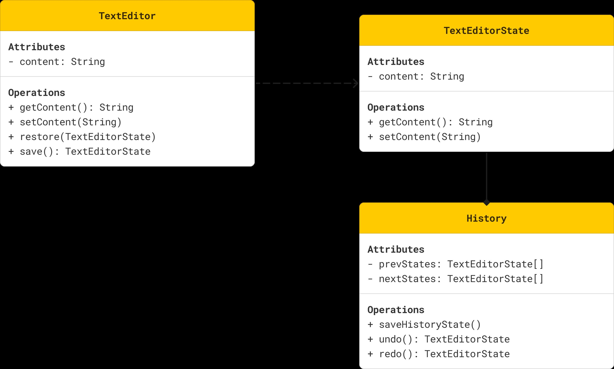

# MEMENTO DESIGN PATTERN

## WHAT IS THE PROBLEM?

You're developing a new Text Editor and you want to provide the functionality of the undo and redo mechanism.
The undo should be able to restore the previous state and the redo should be able to do the vise-versa.

## UML

  

