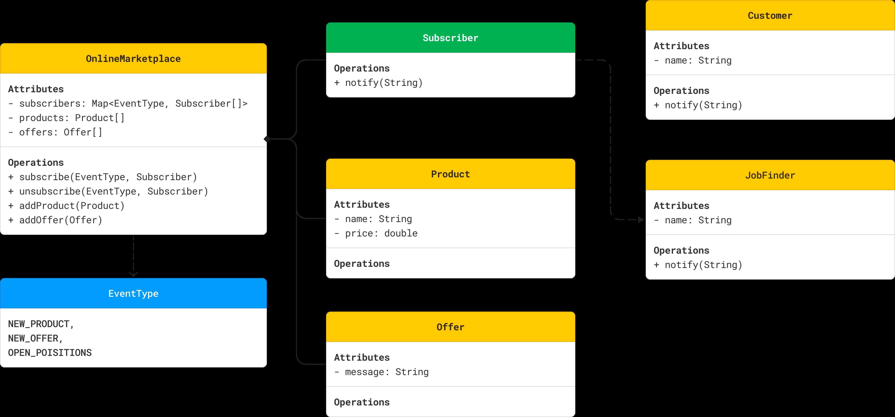

# OBSERVER DESIGN PATTERN

## WHAT IS THE PROBLEM?

We want to create a Marketplace Notification system where users can subscribe to notifications for new product arrivals or new offers in an online marketplace. Whenever a new product or new offer is added to the marketplace, subscribed users should receive notifications.
We should allow both adding new subscribers and cancelling subscription as well.

## UML

  

