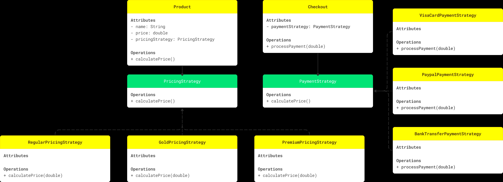

# STRATEGY DESIGN PATTERN

## WHAT IS THE PROBLEM?

You're developing an e-commerce platform where different products may have varying pricing logic based on factors such as customer segment. 
We have regular, gold and premium membership. 
Once product price is calculated, then at the checkout the customer could pay with different methods like PayPal, VisaCard and BankTransfer. 
Each payment method vary in it’s logic of processing the payment and conducting required fees.

## UML

  

