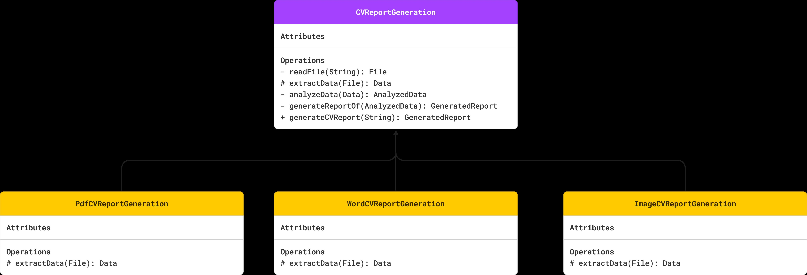

# TEMPLATE DESIGN PATTERN

## WHAT IS THE PROBLEM?

You're developing an a Recruiting Application, which involves uploading CV files in different formats like PDF, image and .doc.
We need to generate a report based on those CVs to know which ones to filter them out.
Generating a report requires some common functionality as reading files, extracting data, analyzing data and finally generating the report.

## UML

  

