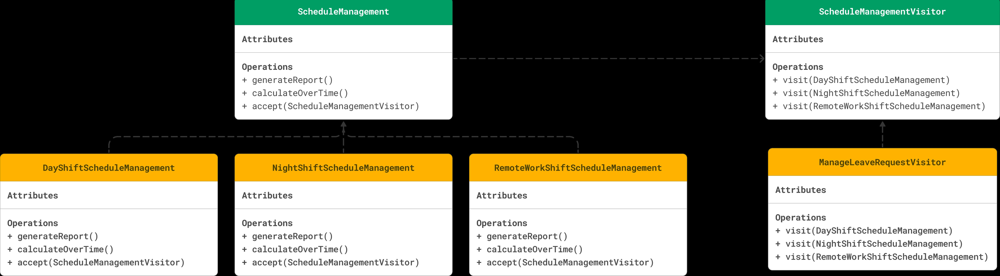

# VISITOR DESIGN PATTERN

## WHAT IS THE PROBLEM?

You're developing a software system for managing employee schedules across different departments and shifts. 
In this system, various operations need to be performed on different types of schedules, such as generating reports and calculating overtime.
You are required to add a new feature that manage the leave requests on each schedule type without touching the codebase as much as you can as it’s in Production.
For simplicity let’s say we have three types of schedules e.g (day shift, night shift and remote work).

## UML

  

